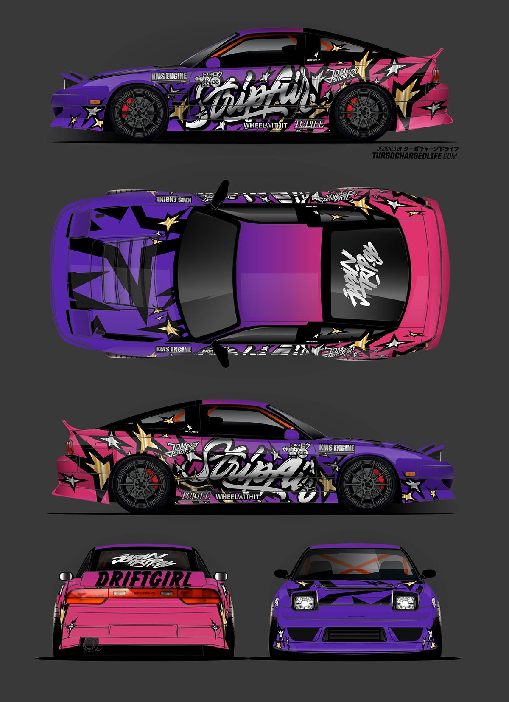
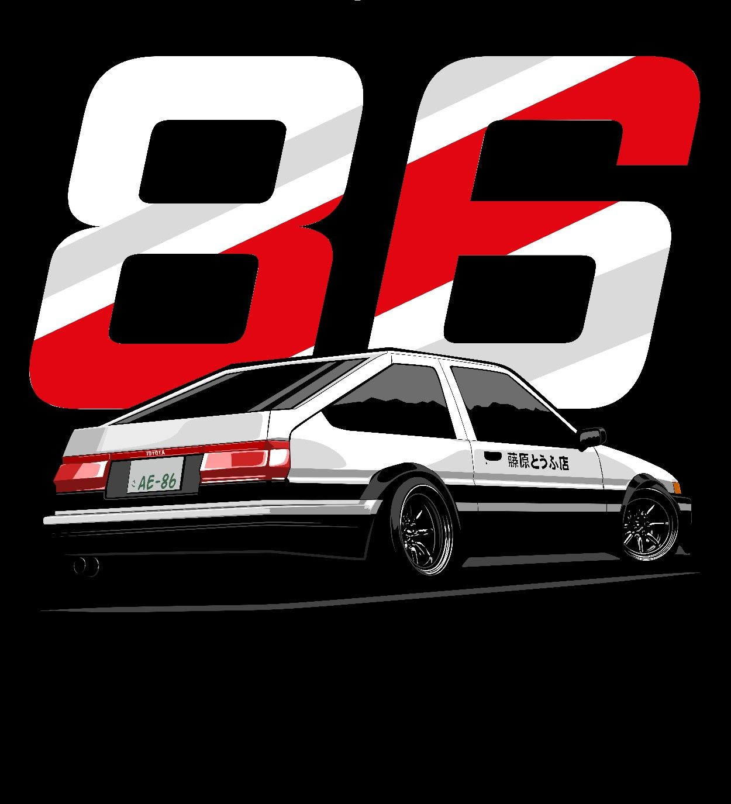

<!DOCTYPE html>
<html lang="en">
<head>
<meta charset="UTF-8">
	<meta name="viewport" content="width=device-width, initial-scale=1.0">
<title>Drift mode</title>
  <link rel="stylesheet" href="drift.css">
<link rel="preconnect" href="https://fonts.googleapis.com">
<link rel="preconnect" href="https://fonts.gstatic.com" crossorigin>
<link href="https://fonts.googleapis.com/css2?family=Mrs+Sheppards&display=swap" rel="stylesheet">
<link rel="preconnect" href="https://fonts.googleapis.com">
<link rel="preconnect" href="https://fonts.gstatic.com" crossorigin>
<link href="https://fonts.googleapis.com/css2?family=Permanent+Marker&display=swap" rel="stylesheet">
<link rel="preconnect" href="https://fonts.googleapis.com">
<link rel="preconnect" href="https://fonts.gstatic.com" crossorigin>
<link href="https://fonts.googleapis.com/css2?family=League+Spartan:wght@500&display=swap" rel="stylesheet">
</head>
<body>
    <section class="drift">
        <video src="video.mp4" autoplay muted  loop></video>
        <h1>Drift mode</h1>
        
        
Drifting is a driving technique where the driver intentionally oversteers, with loss of traction, while maintaining control and driving the car through the entirety of a corner. The technique causes the rear slip angle to exceed the front slip angle to such an extent that often the front wheels are pointing in the opposite direction to the turn (e.g. car is turning left, wheels are pointed right or vice versa, also known as opposite lock or counter-steering). Drifting is traditionally done by clutch kicking (where the clutch is rapidly disengaged and re-engaged with the intention of upsetting the grip of the rear wheels), then intentionally oversteering and countersteering. This sense of drift is not to be confused with the four wheel drift, a classic cornering technique established in Grand Prix and sports car racing.

        

            <a href="drifting.html">Drift</a>
        

        

            <a href="#">Models</a>
        

    </section>
    
    <section class="about">
        <h1>Drifting models</h1>
        
        <h3>Drift cars are most faster than sport cars, because drift cars will tuning to be best and better...🏁</h3>
        
If you wanna to know or see drift car models tap to "Know more".

        <a href="#">Know more</a>
    </section>
    
    <section class="about2">
        <h1>Drift cars are usually light- to moderate-weight rear-wheel-drive coupes and sedans, offering a large range of power levels. There have also been all-wheel drive cars that have been converted to rear-wheel drive such as the Subaru WRX, Toyota Avensis, Scion tC, Mitsubishi Lancer Evolution, Dodge Charger, and Nissan GT-R. Early on, AWD cars without conversion were allowed in some drifting competitions, and usually the rules allowed only a certain percentage of power to be sent to the front wheels, but they are banned in most (if not all) drifting competitions today.</h1>
        <h2>Toyota 86</h2>
        

        <ul>
           <li><a href="#">About Us</a> </li>
           <li><a href="#">Drift cars</a> </li>
           <li><a href="#">About developer</a> </li>
<li><a href="#">Models</a> </li>
</ul>
